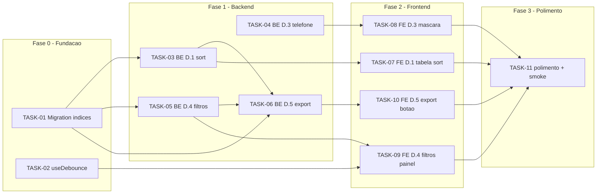

# Plano de Execucao — Fase D parcial (D.1, D.3, D.4, D.5)

## Visao Geral

Este plano operacionaliza as 4 entregas do PRD Fase D parcial (Ordenacao D.1, Mascara
telefone D.3, Filtros avancados D.4, Exportar CSV/XLSX D.5) sobre a stack atual
(FastAPI + SQLAlchemy 2.x + SQLite no backend; Next.js 14 + React + Tailwind + RHF + Zod
no frontend). A estrategia e dividir o trabalho em 4 fases sequenciais: **Fase 0** cria
a base de dados (migration Alembic com indices) e o hook `useDebounce` consolidado, que
sao pre-requisitos minimos das demais entregas; **Fase 1** implementa as alteracoes de
backend (4 tasks majoritariamente paralelizaveis entre si depois da Fase 0); **Fase 2**
cobre o frontend (4 tasks paralelizaveis entre si depois que o backend correspondente
estiver pronto); **Fase 3** fecha com polimento (a11y, documentacao OpenAPI, smoke
test e ajustes regressivos).

A paralelizacao maxima ocorre logo na Fase 0 (TASK-01 e TASK-02 sao 100% independentes
em arquivos disjuntos) e novamente na Fase 1 (TASK-03, TASK-04 e TASK-05 podem rodar
simultaneamente, com merge sequencial no router compartilhado; TASK-06 fica para
quando TASK-03 e TASK-05 ja tiverem aterrado). O orquestrador tem espaco confortavel
para acionar 2 dev-agents em paralelo desde o primeiro disparo.

## Stack Confirmada

- Linguagem backend: Python 3.11+
- Framework backend: FastAPI + SQLAlchemy 2.x + Alembic
- Persistencia: SQLite (existente)
- Exportacao: stdlib `csv` + `openpyxl` + `StreamingResponse`
- Linguagem frontend: TypeScript
- Framework frontend: Next.js 14 + React + Tailwind
- Formularios: react-hook-form + Zod + `react-input-mask`
- Testes: pytest + httpx (backend); Jest + Testing Library (frontend)

## Estrutura de Diretorios Relevante

```
backend/
  alembic/
    versions/                         # nova migration de indices (TASK-01)
  app/
    routers/contatos.py               # editado: sort, filtros, export endpoint
    services/contato_service.py       # editado: ordenacao, filtros, query base
    models/contato.py                 # somente leitura para mapping de colunas
    schemas/contato.py                # editado: regex telefone + enums sort/filtros
    exporters/                        # NOVO (TASK-06)
      __init__.py
      csv_exporter.py
      xlsx_exporter.py
  tests/
    test_contatos_sort.py             # NOVO (TASK-03)
    test_contatos_telefone.py         # NOVO (TASK-04)
    test_contatos_filtros.py          # NOVO (TASK-05)
    test_contatos_export.py           # NOVO (TASK-06)
    test_contatos_smoke_fase_d.py     # NOVO (TASK-11)
frontend/
  src/
    app/contatos/page.tsx             # editado: querystring sort+filtros+export
    components/
      ContatoForm.tsx                 # editado: mascara telefone
      ContatoTable.tsx                # editado: headers ordenaveis + aria-sort
      ContatoFiltersPanel.tsx         # NOVO (TASK-09)
      ContatoExportButton.tsx         # NOVO (TASK-10)
    hooks/
      useDebounce.ts                  # NOVO (TASK-02)
    lib/schemas.ts                    # editado: regex telefone Zod
    services/api.ts                   # editado: helpers sort/filter/export
  __tests__/
    useDebounce.test.ts               # NOVO (TASK-02)
    contatos.sort.test.tsx            # NOVO (TASK-07)
    contatoForm.telefone.test.tsx     # NOVO (TASK-08)
    contatos.filtros.test.tsx         # NOVO (TASK-09)
    contatos.export.test.tsx          # NOVO (TASK-10)
docs/
  PLANO_EXECUCAO.md
```

---

## Fase 0 — Fundacao (DB + Hook)

> Pre-requisitos minimos de D.1 / D.4 e do reuso de debounce nos filtros.
> Duas tasks 100% independentes para o orquestrador disparar em 2 dev-agents.

### TASK-01 — Migration Alembic com indices em colunas frequentes
- **Objetivo**: Adicionar indices nao-unicos em `contatos.nome`, `contatos.email`,
  `contatos.empresa`, `contatos.criado_em` para suportar ordenacao (D.1) e
  filtros (D.4) com p95 < 300 ms ate 50k linhas (RNF-01).
- **Arquivos a criar/editar**:
  - Criar: `backend/alembic/versions/<rev>_indices_contatos_sort_filter.py`
- **Descricao**: Gerar uma nova revisao Alembic adicionando indices nao-unicos
  (`ix_contatos_nome`, `ix_contatos_email`, `ix_contatos_empresa`,
  `ix_contatos_criado_em`). `downgrade()` deve dropar os indices criados. NAO
  alterar `backend/app/models/contato.py` nesta task (decisao: indices via
  migration pura, para minimizar conflito com tasks paralelas; refletir no
  modelo fica como ajuste opcional na Fase 3 se necessario).
- **Criterios de aceite**:
  - `alembic upgrade head` aplica a revisao sem erro em base existente.
  - `alembic downgrade -1` reverte sem erro.
  - Indices presentes via `PRAGMA index_list('contatos')` em SQLite.
  - Regressivo backend continua verde.
- **Dependencias**: nenhuma.
- **Paralelizavel com**: TASK-02.

### TASK-02 — Hook `useDebounce` consolidado
- **Objetivo**: Substituir o uso ad-hoc de debounce em `contatos/page.tsx` por
  um hook reusavel, requisito do filtro `empresa` (RF-05) e ja antecipado pelo
  PRD (secao 4).
- **Arquivos a criar/editar**:
  - Criar: `frontend/src/hooks/useDebounce.ts`
  - Criar: `frontend/__tests__/useDebounce.test.ts`
- **Descricao**: Implementar `useDebounce<T>(value: T, delay = 300): T` em
  TypeScript estrito. Teste cobre: valor inicial retorna sem espera; alteracoes
  rapidas retornam apenas o ultimo valor apos `delay` (usar `jest.useFakeTimers`).
  NAO tocar em `contatos/page.tsx` ainda — a substituicao ocorre em TASK-09.
- **Criterios de aceite**:
  - `useDebounce.ts` exporta hook tipado.
  - Teste passa em `jest` isolado (fake timers).
  - Lint frontend sem warnings novos.
- **Dependencias**: nenhuma.
- **Paralelizavel com**: TASK-01.

---

## Fase 1 — Backend (D.1, D.3, D.4, D.5)

> Quatro tasks de backend isoladas em arquivos distintos ao maximo. Apos Fase 0,
> TASK-03, TASK-04 e TASK-05 podem comecar em paralelo. TASK-06 aguarda TASK-03
> e TASK-05 por reusar a query base de listagem.

### TASK-03 — Backend D.1: ordenacao com allowlist
- **Objetivo**: Implementar `sort_by` / `sort_order` em `GET /contatos/` (RF-01,
  RNF-03).
- **Arquivos a criar/editar**:
  - Editar: `backend/app/routers/contatos.py` (apenas o endpoint de listagem —
    bloco de query params; SECAO "ordenacao")
  - Editar: `backend/app/services/contato_service.py` (apenas a funcao
    `listar_contatos` — adicionar parametros `sort_by` / `sort_order` e
    aplicar `order_by` via `getattr(Contato, col)` apos validacao em allowlist)
  - Editar: `backend/app/schemas/contato.py` (apenas adicionar enums
    `SortByContato` e `SortOrder`; nao mexer em outros schemas)
  - Criar: `backend/tests/test_contatos_sort.py`
- **Descricao**: Allowlist = {`nome`, `email`, `empresa`, `telefone`,
  `criado_em`, `atualizado_em`}. Default = `criado_em desc` (preservar
  comportamento atual). Qualquer outro valor -> 422 via Pydantic enum. ORM
  aplica `order_by` por `getattr` — proibida concatenacao de string em SQL.
  Log estruturado herda `request_id` (B.1) e inclui `sort_by`/`sort_order`.
- **Criterios de aceite**:
  - `GET /contatos/?sort_by=nome&sort_order=desc` retorna lista ordenada DESC.
  - `sort_by=invalido` retorna 422 com mensagem clara.
  - Sem `sort_by` mantem comportamento atual (regressivo verde).
  - Teste novo cobre asc, desc, default, invalido (>= 4 cases).
- **Dependencias**: TASK-01 (indices recomendados para perf, funcional sem).
- **Paralelizavel com**: TASK-04, TASK-05. Ver "Nota de paralelismo" abaixo.

### TASK-04 — Backend D.3: regex telefone no Pydantic
- **Objetivo**: Validar telefone no schema do backend conforme contrato
  `(99) 99999-9999` (RF-04).
- **Arquivos a criar/editar**:
  - Editar: `backend/app/schemas/contato.py` (apenas o campo `telefone` nos
    schemas `ContatoCreate` / `ContatoUpdate` — adicionar `Field(pattern=...)`
    ou `field_validator` com regex)
  - Criar: `backend/tests/test_contatos_telefone.py`
- **Descricao**: Regex aceita `^\(\d{2}\) \d{5}-\d{4}$` (formatado), que e o
  contrato unico desta entrega (alinhado a TASK-08 no frontend). Manter
  telefone opcional (None ou string vazia continuam aceitos). Erro 422 com
  mensagem clara em PT-BR. Nao remover/alterar codigo de auditoria existente.
- **Criterios de aceite**:
  - POST com telefone valido `(11) 91234-5678` -> 201.
  - POST com telefone invalido (ex: `123`) -> 422.
  - POST sem telefone -> 201 (continua opcional).
  - PATCH com telefone invalido -> 422.
  - Regressivo verde.
- **Dependencias**: nenhuma (so toca `schemas/contato.py` em campo distinto
  das demais tasks).
- **Paralelizavel com**: TASK-03, TASK-05, TASK-06.

### TASK-05 — Backend D.4: filtros avancados
- **Objetivo**: Adicionar parametros `empresa`, `criado_de`, `criado_ate`,
  `sem_email`, `sem_telefone` em `GET /contatos/` (RF-06).
- **Arquivos a criar/editar**:
  - Editar: `backend/app/routers/contatos.py` (apenas o endpoint de
    listagem — adicionar os novos query params; SECAO "filtros")
  - Editar: `backend/app/services/contato_service.py` (adicionar logica de
    filtro em `listar_contatos` — secao distinta da ordenacao)
  - Editar: `backend/app/schemas/contato.py` (adicionar validator que
    rejeita `criado_de > criado_ate` com 422; RNF-05)
  - Criar: `backend/tests/test_contatos_filtros.py`
- **Descricao**: Filtros aplicados via `where`/`filter` no SQLAlchemy.
  `sem_email` / `sem_telefone` traduzem para `IS NULL OR == ''`. `empresa` e
  busca por `ilike`. Combinaveis com `search`, `sort_by`, `sort_order` e
  paginacao. Log inclui filtros aplicados (sem PII alem do `user_id`).
- **Criterios de aceite**:
  - Filtros isolados retornam subset correto.
  - Combinacao de >= 2 filtros funciona.
  - `criado_de > criado_ate` -> 422.
  - Combinacao com `search` + `sort_by` retorna corretamente.
  - Cobertura novo arquivo >= 95% no modulo de contatos.
- **Dependencias**: TASK-01 (indice em `empresa`/`criado_em` para perf).
- **Paralelizavel com**: TASK-03, TASK-04. Ver "Nota de paralelismo" abaixo.

> **Nota de paralelismo entre TASK-03 e TASK-05**: ambas editam
> `routers/contatos.py`, `services/contato_service.py` e `schemas/contato.py`.
> Para evitar conflito, cada agente toca em BLOCOS distintos do mesmo arquivo
> (T03 = bloco "ordenacao"; T05 = bloco "filtros"); o orquestrador valida que
> os diffs nao se sobrepoem antes do merge. Caso o orquestrador siga politica
> "1 arquivo = 1 agente por vez", serializar: rodar TASK-03 e TASK-04 em
> paralelo na onda 2; TASK-05 entra na onda 2b apos merge de TASK-03.

### TASK-06 — Backend D.5: endpoint de exportacao CSV / XLSX
- **Objetivo**: Expor `GET /contatos/export?format=csv|xlsx` com
  `StreamingResponse` (RF-07 a RF-10, RNF-02).
- **Arquivos a criar/editar**:
  - Criar: `backend/app/exporters/__init__.py`
  - Criar: `backend/app/exporters/csv_exporter.py` (gera linhas CSV via
    generator + stdlib `csv`)
  - Criar: `backend/app/exporters/xlsx_exporter.py` (gera workbook com
    `openpyxl` em `BytesIO`; se exceder limite de memoria, fallback
    documentado conforme R4 do PRD)
  - Editar: `backend/app/routers/contatos.py` (adicionar endpoint
    `/contatos/export` — apenas append; nao mexer no endpoint de listagem)
  - Editar: `backend/app/services/contato_service.py` (extrair query base
    reutilizavel `_montar_query_listagem` para ser usada por listagem E
    exportacao — depende dos blocos de sort/filtros estaveis)
  - Editar: `backend/requirements.txt` (adicionar `openpyxl` se ausente,
    com versao pinada)
  - Criar: `backend/tests/test_contatos_export.py`
- **Descricao**: Endpoint aceita mesmos params de listagem (search, sort_by,
  sort_order, filtros D.4) mas IGNORA paginacao (RF-08). Soft-deleted nao
  entra (RF-09). Colunas fixas: `id`, `nome`, `email`, `telefone`, `empresa`,
  `criado_em`, `atualizado_em` com headers em PT-BR. `Content-Type` apropriado
  e `Content-Disposition: attachment; filename="contatos_YYYYMMDD_HHMMSS.<ext>"`.
  Log com `route`, `user_id`, `format`, `rows_exported`, `duration_ms`
  (RF-10).
- **Criterios de aceite**:
  - GET com `format=csv` devolve `text/csv; charset=utf-8` + header
    `Content-Disposition` com timestamp.
  - GET com `format=xlsx` devolve mimetype
    `application/vnd.openxmlformats-officedocument.spreadsheetml.sheet` +
    arquivo abrivel em Excel/LibreOffice/Sheets (RNF-08 validado via
    fixture de teste + verificacao manual).
  - Soft-deleted excluido.
  - Resposta usa `StreamingResponse` (validado em teste).
  - `format` invalido -> 422.
  - Log estruturado emitido com campos exigidos.
  - Aplica filtros + sort + search atuais (validar em teste de combinacao).
- **Dependencias**: TASK-01 (perf), TASK-03 (reusa sort), TASK-05 (reusa
  filtros).
- **Paralelizavel com**: TASK-04 (apenas TASK-04). A estrutura dos exporters
  (`exporters/*.py`) PODE ser iniciada em paralelo a TASK-03 e TASK-05, mas
  o merge final do router e do `contato_service.py` deve ocorrer apos
  estabilizacao dessas tasks.

---

## Fase 2 — Frontend (D.1, D.3, D.4, D.5)

> Cada feature em componente proprio. Tasks paralelizaveis entre si depois que
> o backend correspondente estiver pronto.

### TASK-07 — Frontend D.1: tabela ordenavel + querystring
- **Objetivo**: Renderizar headers ordenaveis (`nome`, `email`, `empresa`,
  `criado_em`) com tri-state none/asc/desc, refletir na URL (RF-02, RNF-06).
- **Arquivos a criar/editar**:
  - Editar: `frontend/src/components/ContatoTable.tsx` (so headers + icones
    de seta + `aria-sort` — RNF-07; props expandidas com callback `onSort`)
  - Editar: `frontend/src/app/contatos/page.tsx` (estado de sort,
    sincronizacao com `searchParams`, passar para `api.ts`)
  - Editar: `frontend/src/services/api.ts` (adicionar `sort_by` /
    `sort_order` na funcao de listagem)
  - Criar: `frontend/__tests__/contatos.sort.test.tsx`
- **Descricao**: Tri-state: none -> asc -> desc -> none. URL recebe `sort_by`
  e `sort_order`. Refresh mantem o estado. Icones acessiveis (seta para
  cima/baixo + `aria-sort="ascending|descending|none"`).
- **Criterios de aceite**:
  - Clicar no header alterna estados; URL atualiza.
  - Refresh com `?sort_by=nome&sort_order=desc` aplica ordenacao.
  - `aria-sort` reflete estado correto.
  - Teste cobre caminho feliz e tri-state.
- **Dependencias**: TASK-03.
- **Paralelizavel com**: TASK-08, TASK-09, TASK-10. Atencao a merge em
  `page.tsx` e `api.ts` (compartilhados com TASK-09 e TASK-10).

### TASK-08 — Frontend D.3: mascara telefone + Zod
- **Objetivo**: Aplicar `react-input-mask` no campo telefone do `ContatoForm`
  e alinhar Zod (RF-03, RF-04).
- **Arquivos a criar/editar**:
  - Editar: `frontend/src/components/ContatoForm.tsx` (apenas campo
    telefone — wrapping com `react-input-mask` via RHF `Controller`)
  - Editar: `frontend/src/lib/schemas.ts` (apenas o campo `telefone` do
    schema — regex compativel com contrato definido em TASK-04)
  - Criar: `frontend/__tests__/contatoForm.telefone.test.tsx`
- **Descricao**: Manter telefone opcional. Mascara `(99) 99999-9999`.
  Mensagem de erro em PT-BR clara ("Telefone deve estar no formato
  (XX) XXXXX-XXXX"). Aceitar colagem (R7 do PRD) — comportamento padrao do
  `react-input-mask` cobre isso.
- **Criterios de aceite**:
  - Digitar telefone aplica mascara no campo.
  - Submit com telefone valido -> sem erro.
  - Submit com telefone invalido -> erro Zod exibido.
  - Submit sem telefone -> aceito.
  - Teste cobre 3 casos (vazio, valido, invalido).
- **Dependencias**: TASK-04 (alinhamento de contrato regex).
- **Paralelizavel com**: TASK-07, TASK-09, TASK-10 (arquivos disjuntos).

### TASK-09 — Frontend D.4: painel de filtros colapsavel + useDebounce
- **Objetivo**: Implementar painel "Filtros" com campos do RF-05 e refletir
  em URL (RNF-06).
- **Arquivos a criar/editar**:
  - Criar: `frontend/src/components/ContatoFiltersPanel.tsx` (componente
    proprio — colapsavel, controla estado dos 5 filtros, chama callback
    `onChange`)
  - Editar: `frontend/src/app/contatos/page.tsx` (montar o painel acima
    da tabela, ler/escrever `searchParams` para `empresa`/`criado_de`/
    `criado_ate`/`sem_email`/`sem_telefone`, substituir debounce ad-hoc
    pelo `useDebounce` da TASK-02)
  - Editar: `frontend/src/services/api.ts` (adicionar params de filtro
    na funcao de listagem — coexistir com TASK-07)
  - Criar: `frontend/__tests__/contatos.filtros.test.tsx`
- **Descricao**: Estado colapsavel lembrado em `sessionStorage` ("lembrado
  durante a sessao"). Filtro `empresa` usa `useDebounce(300ms)`. Date
  pickers exibem `DD/MM/AAAA` (RNF-10). Combinavel com search + sort +
  paginacao sem perda de estado.
- **Criterios de aceite**:
  - Painel abre/fecha; estado persiste em refresh dentro da sessao.
  - Filtros refletem na URL (deep link funcional).
  - `empresa` faz debounce de 300 ms (validado com fake timers).
  - Teste cobre 4 cenarios: empresa, range data, booleano, combinacao.
- **Dependencias**: TASK-02, TASK-05.
- **Paralelizavel com**: TASK-07, TASK-08, TASK-10. Para `page.tsx` e
  `api.ts` (compartilhados), cada task toca em SECAO distinta (T07 =
  estado de sort; T09 = estado de filtros; T10 = botao export); merge
  controlado pelo orquestrador.

### TASK-10 — Frontend D.5: botao Exportar com menu CSV/XLSX
- **Objetivo**: Botao "Exportar" com dropdown (RF-07), chamando endpoint
  da TASK-06.
- **Arquivos a criar/editar**:
  - Criar: `frontend/src/components/ContatoExportButton.tsx` (botao +
    dropdown + dispara download chamando endpoint com search/filtros/
    sort atuais)
  - Editar: `frontend/src/app/contatos/page.tsx` (montar o botao perto
    do filtro/topo da tabela, passando o estado consolidado de query)
  - Editar: `frontend/src/services/api.ts` (helper
    `exportarContatos(format, params)` que constroi URL e dispara
    download via fetch + Blob + `URL.createObjectURL`)
  - Criar: `frontend/__tests__/contatos.export.test.tsx`
- **Descricao**: Botao mostra dois itens: "Exportar CSV", "Exportar Excel".
  `aria-label` no botao e nos itens (RNF-07). Mantem busca + filtros +
  sort atuais. Indicador visual de loading durante o request.
- **Criterios de aceite**:
  - Botao visivel na pagina `/contatos`.
  - Clique em CSV chama `GET /contatos/export?format=csv` com params
    atuais.
  - Clique em XLSX idem para `format=xlsx`.
  - Download dispara (validado via mock de `URL.createObjectURL`).
  - `aria-label` presente em botao e itens.
  - Teste cobre os dois formatos.
- **Dependencias**: TASK-06.
- **Paralelizavel com**: TASK-07, TASK-08, TASK-09 (arquivos majoritariamente
  disjuntos; merge em `page.tsx`/`api.ts` por secoes).

---

## Fase 3 — Polimento

### TASK-11 — Polimento, doc OpenAPI e smoke test
- **Objetivo**: Fechar a entrega com revisao de a11y, documentacao OpenAPI
  e teste ponta-a-ponta simplificado.
- **Arquivos a criar/editar**:
  - Editar: `backend/app/routers/contatos.py` (apenas docstrings/summary/
    description dos novos endpoints, exemplos OpenAPI dos novos params)
  - Editar: `backend/app/schemas/contato.py` (apenas `Field(..., examples=)`
    nos novos enums/parametros se faltar)
  - Editar: `frontend/src/components/ContatoTable.tsx` (revisao
    `aria-sort` / foco / navegacao por teclado)
  - Editar: `frontend/src/components/ContatoExportButton.tsx` (revisao
    `aria-label`)
  - Criar: `backend/tests/test_contatos_smoke_fase_d.py` (smoke: lista +
    ordena + filtra + exporta CSV num unico fluxo)
- **Descricao**: Verificar todos os criterios RNF-04 (logs), RNF-07 (a11y),
  RNF-09 (cobertura >= 95% no modulo de contatos). Atualizar exemplos
  OpenAPI para que a doc gerada `/docs` mostre os novos parametros. Smoke
  test usa fixtures pequenas (10 contatos) e exercita o fluxo completo
  (lista -> ordena -> filtra -> exporta CSV).
- **Criterios de aceite**:
  - `/docs` (Swagger UI) mostra `sort_by`, `sort_order`, filtros e
    `/contatos/export` com descricoes claras e exemplos.
  - Regressivo backend verde (manter 236+ tests passando).
  - Cobertura modulo contatos >= 95%.
  - Smoke test passa em < 5 segundos.
  - `aria-sort` e `aria-label` revisados sem warnings axe basicos.
- **Dependencias**: TASK-03, TASK-04, TASK-05, TASK-06, TASK-07, TASK-08,
  TASK-09, TASK-10.
- **Paralelizavel com**: nenhuma (fase final).

---

## Diagrama de Paralelismo (Mermaid)



ASCII alternativo (resumo de ondas):

```
Onda 1 (Fase 0)     : [TASK-01]  ||  [TASK-02]
Onda 2 (Fase 1)     : [TASK-03]  ||  [TASK-04]  ||  [TASK-05]   (apos T01)
Onda 3 (Fase 1)     : [TASK-06]                                   (apos T01, T03, T05)
Onda 4 (Fase 2)     : [TASK-07] (apos T03)  ||  [TASK-08] (apos T04)
                      [TASK-09] (apos T02, T05)  ||  [TASK-10] (apos T06)
Onda 5 (Fase 3)     : [TASK-11]                                   (apos todas)
```

---

## Matriz de Paralelizacao

| Task    | Depende de              | Paraleliza com              | Arquivos exclusivos? |
|---------|-------------------------|-----------------------------|----------------------|
| TASK-01 | nenhuma                 | TASK-02                     | Sim (migration nova) |
| TASK-02 | nenhuma                 | TASK-01                     | Sim (hook novo + teste) |
| TASK-03 | TASK-01                 | TASK-04, TASK-05            | Compartilha router/service com T05 (blocos distintos) |
| TASK-04 | nenhuma                 | TASK-03, TASK-05, TASK-06   | Sim (campo telefone isolado) |
| TASK-05 | TASK-01                 | TASK-03, TASK-04            | Compartilha router/service com T03 (blocos distintos) |
| TASK-06 | TASK-01, TASK-03, TASK-05 | TASK-04                   | Maior parte exclusiva (exporters/) |
| TASK-07 | TASK-03                 | TASK-08, TASK-09, TASK-10   | Compartilha page/api com T09 e T10 |
| TASK-08 | TASK-04                 | TASK-07, TASK-09, TASK-10   | Sim (form + schemas) |
| TASK-09 | TASK-02, TASK-05        | TASK-07, TASK-08, TASK-10   | Compartilha page/api (secoes distintas) |
| TASK-10 | TASK-06                 | TASK-07, TASK-08, TASK-09   | Compartilha page/api (secoes distintas) |
| TASK-11 | T03-T10                 | nenhuma                     | Polimento final |

---

## Resumo de Paralelismo por Onda

| Onda | Tasks em paralelo                          | Qtde paralela |
|------|--------------------------------------------|---------------|
| 1    | TASK-01, TASK-02                           | 2             |
| 2    | TASK-03, TASK-04, TASK-05                  | 3             |
| 3    | TASK-06 (+ TASK-04 se ainda em andamento)  | 1-2           |
| 4    | TASK-07, TASK-08, TASK-09, TASK-10         | 4             |
| 5    | TASK-11                                    | 1             |

**Total de tasks**: 11
**Paralelizaveis ja na Onda 1**: 2 (TASK-01 e TASK-02) — atende ao requisito
minimo de 2 dev-agents simultaneos no primeiro disparo.
**Paralelizaveis na Onda 2**: 3 (TASK-03, TASK-04, TASK-05).
